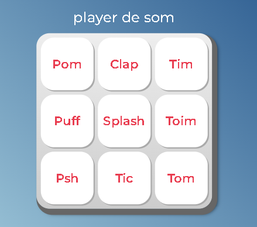

## Player de Som Interativo
Este é um player de som interativo desenvolvido em JavaScript. Ele permite reproduzir sons ao clicar em teclas específicas ou pressionar teclas do teclado.

## Funcionalidades
- tocaSom(seletorAudio): Esta função reproduz o som do elemento de áudio selecionado com base no seletor fornecido. Se o seletor for inválido ou o elemento de áudio não for encontrado, um alerta será exibido.
- Controle de Teclas: O player permite tocar os sons associados a teclas específicas do teclado. Ao clicar em uma tecla ou pressionar a tecla correspondente no teclado, o som será reproduzido. As teclas ativadas também receberão um efeito visual.

